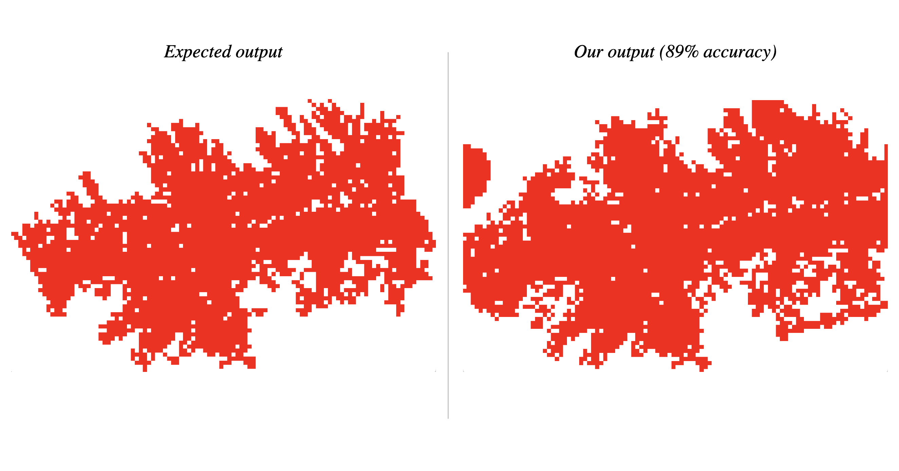
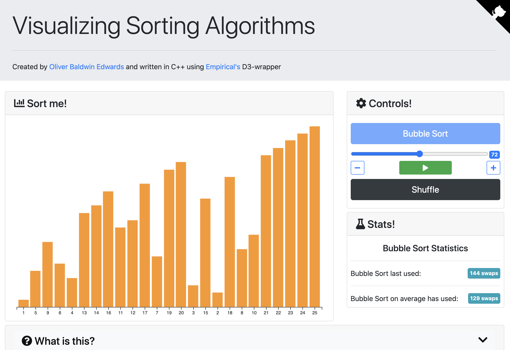
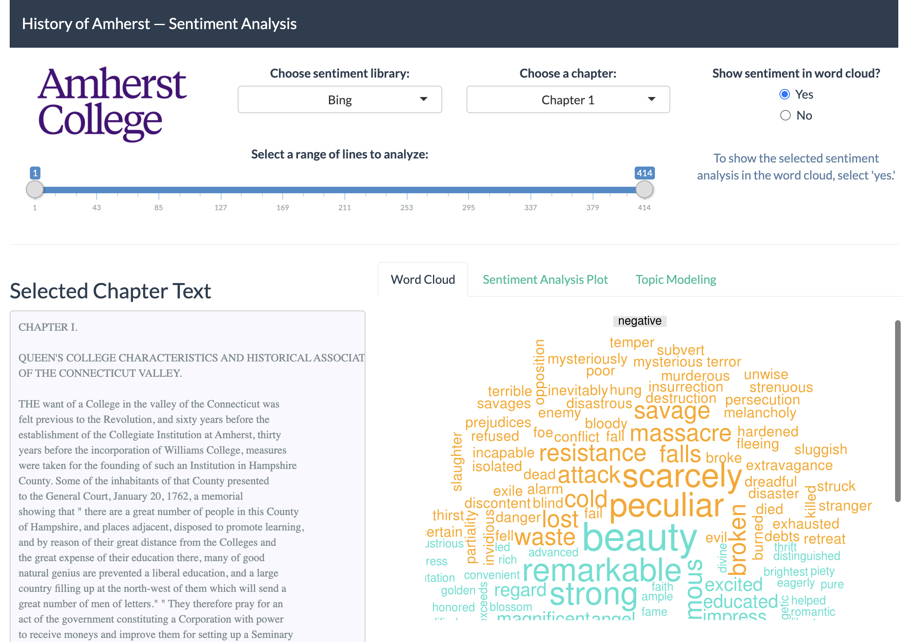
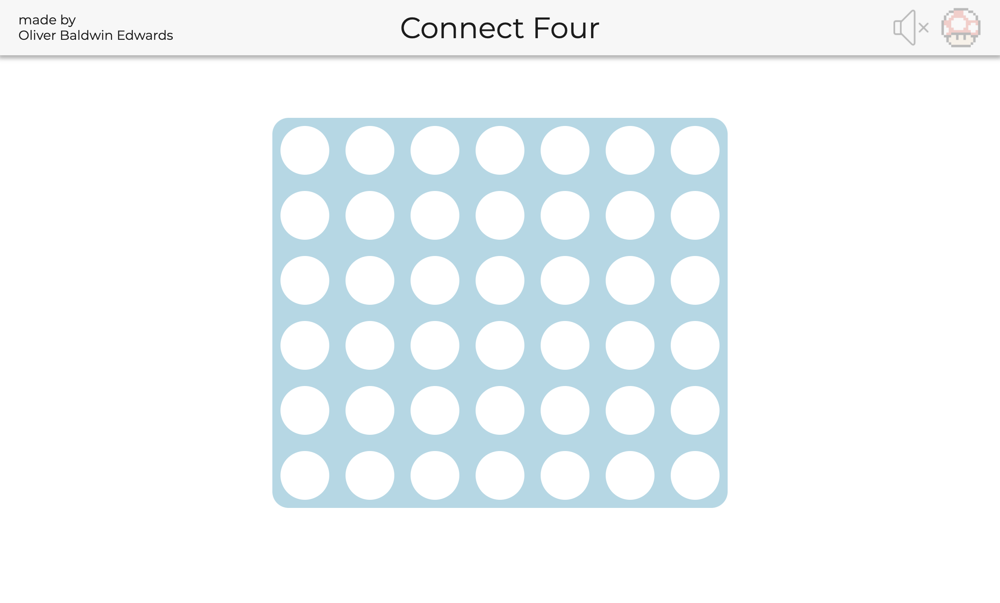

## Portfolio

Welcome to my portfolio! Click the name of a project to see its corresponding GitHub page or website (when applicable).

### Technical Projects

---
#### [Ring of Fire: Evolving a Wildfire Simulator using Genetic Programming](https://github.com/Oliver-BE/ring-of-fire)

A **parallelized genetic program** for evolving rules that describe a cellular automaton based wildfire simulation. Both the genetic program and the wildfire simulator were written in **Clojure** by [@icaruso21](https://github.com/icaruso21), [@MGlusker](https://github.com/MGlusker), and myself.

---

#### Various Pacman AI Projects

Using **Python** I implemented various AI algorithms in a Pacman setting including:
- Exact inference and particle filtering to read noisy data using Bayes' Nets
- Reinforcement learning algorithms such as Temporal Difference Q-learning
- DFS, BFS, UCS, and A* to find food pellets

I also created a team of agents to play a capture the flag version of Python. I used particle filtering to estimate the position of enemy Pacman agents, a minimax algorithm with alpha-beta pruning to select my agents' next move, and different evaluation functions for offensive/defensive moves. 

---

#### [Intellage: An Intelligent Photo Collage Creator](https://github.com/icaruso21/intellage)

Written entirely from scratch in **Java** by [@icaruso21](https://github.com/icaruso21) and myself, `Intellage` recreates a desired photo from a user-specified collection of `.jpg` images. The following outputs from `Intellage` each utilized an input folder containing 26,000 stock images:

---

#### Predicting GDP based on transit data
photo of shiny app description of models and data wrangling

---

 

### Data Visualizations 

#### [Visualizing Sorting Algorithms using Empirical](https://oliver-be.ml/sorting-algorithms-d3/)

A web app written entirely in **C++** that utilizes the Empirical D3-wrapper that I helped to write as a 2020 [WAVES](https://mmore500.com/waves/index.html) participant. This project is meant to serve as a demo for how the new D3-wrapper can be used with [Empirical](https://github.com/devosoft/Empirical) to create powerful web apps.

Along with [@elizabethcarney](https://github.com/elizabethcarney), [@amlalejini](https://github.com/amlalejini), and [@emilydolson](https://github.com/emilydolson) I spent the summer creating a C++ wrapper for **[D3.js](https://D3js.org)**, a JavaScript library that allows for custom-made, interactive visualizations. We began the process of overhauling Empirical's web visualization support for use in the next version of [Avida-ED](https://avida-ed.msu.edu/).

For more information on what I did, see [this blog post I wrote.](https://mmore500.com/waves/blog/d3-sorting.html)

---

#### [Interactive Directed Graph Creator](https://oliver-be.ml/interactive-directed-graph-creator/)

A fully interactive web app for creating directed graphs using **D3**'s force layout. This was built as a prototype for a [state chart](https://www.tutorialspoint.com/uml/uml_statechart_diagram.html) as part of the work I did as a research assistant for the [Tulane Visualization and Graphics Group](https://tulanevisgraphics.bitbucket.io/).

---

#### [COVID-19 Visualization](https://oliver-be.ml/covid-d3/) 

An interactive visualization of COVID-19 data obtained from the New York Times built from scratch using **D3**.

---

 

### Smaller Assorted Projects

---

#### [Textual Analysis Shiny App](https://r.amherst.edu/apps/obaldwinedwards21/AmherstHistory/)

A Shiny app created to supplement and visualize textual analysis of the book *History of Amherst College during the First Half Century*.

---

#### [Predicting Hurricane Deaths](/pdf/hurricane-deaths.pdf)

A project that focused on predicting the number of deaths caused by named US hurricanes using a Generalized Additive Model (GAM).

---

#### [Connect Four](https://oliver-be.ml/connect-four/)

A **JS/CSS/HTML** implementation of Connect Four written from scratch as a way to help teach myself web development.

